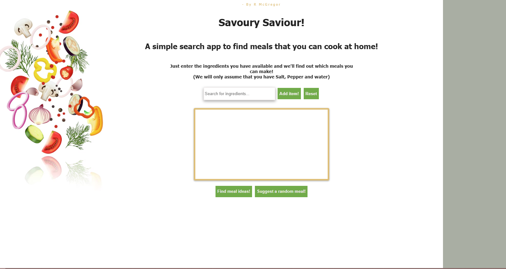

# Meal-Finder.ts

A meal finder where the user can input what ingredients they have and the app returns a meal they could make.
The recipe finder app also has a random meal option if the user just wants a meal recommendation.
The amount of meal options are very limited because i am not using a backend server to pull from or an API that contains more options, so this is more of a working example.

THINGS TO DO:
 - Fix the fact that when the most recent ingredient is added to the list (or only ingredient at the time) gets deleted, it cannot remove the child node from the parent. The other ingredients are able to be deleted though.
 - Possibly create or pull from an API for more meal options.
 - Try to streamline the code more, refactor!

For a working example of this project, please use my CodePen link below:

https://codepen.io/BobbyArmac/full/OPLZXYO 
